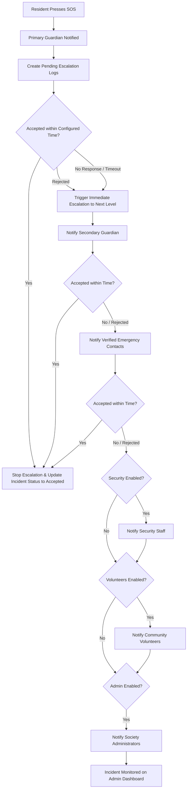

# DAY 11 – GUARDIAN ESCALATION WORKFLOW REPORT

## Overview
Day 11 implements an automated **Guardian Escalation Workflow** for CareConnect. The system ensures that every SOS incident triggered by a resident is acknowledged and responded to within a configurable timeout. If the primary guardian does not respond within the defined response time, the system automatically escalates the incident to secondary guardians, verified emergency contacts, security staff, community volunteers, and society administrators.

---

## Architecture

The escalation workflow operates on a decoupled architecture across three layers:

1. **Django Backend**:
   - Centralized `EscalationConfig` model storing active escalation rules and configurable response timeouts.
   - Audit trail `EscalationLog` model tracking every escalation level transition, recipient, reason, timestamp, and status.
   - Service layer `SOSService` handling automatic scheduling, notification dispatching, acceptance processing, and rejection immediate-escalation logic.
   - Background daemon worker checking pending scheduled steps periodically.

2. **Flutter Mobile App**:
   - Guardian SOS Alert screen (`sos_detail_screen.dart`) featuring real-time incident details, Google Map preview, emergency priority badge, Accept / Reject buttons, direct phone dialer ("Call Resident"), navigation helper ("Navigate"), live countdown timer, and an automated escalation banner.

3. **React Admin Portal**:
   - `EscalationSettings.jsx` featuring dynamic configuration management (timeout in minutes/seconds, target group toggle switches) and a real-time **Escalation Incident Monitoring & Logs** dashboard.

---

## Database Changes & Models

### Models Updated/Added in `sos/models.py`:

#### 1. `EscalationConfig` (Alias: `EscalationConfiguration`)
- `response_time_minutes`: Integer field defining response timeout in minutes (default: 5).
- `response_time_window`: Integer field defining timeout window in seconds for fine-grained/test configuration (default: 30s).
- `escalation_enabled`: Boolean flag to enable or disable automatic escalation globally.
- `notify_security`: Boolean flag to enable/disable security staff notification.
- `notify_volunteers`: Boolean flag to enable/disable community volunteer notification.
- `notify_admin`: Boolean flag to enable/disable system admin notification.
- `created_at` / `updated_at`: Timestamp fields.

#### 2. `EscalationLog`
- `incident`: ForeignKey to `SOSIncident`.
- `step`: CharField indicating step name (`Primary Guardian`, `Secondary Guardian`, `Emergency Contacts`, `Security`, `Volunteers`, `Admin`, `Accepted`, `Rejected`).
- `escalation_level`: CharField for level classification.
- `previous_recipient`: CharField for the source recipient.
- `new_recipient`: CharField for the target recipient.
- `reason`: TextField storing rejection or auto-escalation reasons.
- `status`: CharField (`PENDING`, `TRIGGERED`, `ACCEPTED`, `CANCELLED`, `REJECTED`).
- `response_status`: CharField for user response tracking.
- `scheduled_at`: DateTimeField for planned escalation trigger.
- `triggered_at`: DateTimeField for actual execution timestamp.
- `created_at`: DateTimeField auto-timestamp.

---

## APIs Added / Updated

| Method | Route | Description |
| :--- | :--- | :--- |
| `GET` | `/api/escalation/config` | Retrieve active escalation response configuration |
| `PUT` | `/api/escalation/config` | Update escalation timeouts & notification group toggles |
| `GET` | `/api/escalation/logs` | List all historical and active escalation logs |
| `GET` | `/api/incident/{id}/escalation` | Retrieve incident-specific escalation status & tracking history |
| `POST` | `/api/incident/{id}/accept` | Accept SOS incident, stopping all pending escalations |
| `POST` | `/api/incident/{id}/reject` | Reject SOS incident, triggering immediate escalation to next level |

---

## Escalation Flow Diagram

---

## Flutter Mobile Screens

- **Guardian SOS Alert Screen (`sos_detail_screen.dart`)**:
  - **Resident Name & Priority Badge**: Displays full name and priority status (LOW, MEDIUM, HIGH, CRITICAL).
  - **SOS Category & Emergency Message**: Detailed category name and description text/audio attachments.
  - **Location & Map Preview**: Displays address, coordinates, and open map action.
  - **Accept Button**: Calls `POST /api/incident/{id}/accept`, stops escalation timer, records acceptance log.
  - **Reject Button**: Calls `POST /api/incident/{id}/reject`, records rejection reason, advances to next level immediately.
  - **Call Resident Button**: Initiates phone dialer call to resident (`tel:<phone>`).
  - **Navigate Button**: Launches Google Maps navigation with exact coordinates.
  - **Live Timer & Banner**: Shows remaining response time and displays `"This incident has been escalated."` if timeout expires without action.

---

## React Admin Portal Screens

- **Escalation Configuration & Monitoring Page (`admin-portal/src/pages/EscalationSettings.jsx`)**:
  - **Configuration Section**: Controls for timeout minutes/seconds, auto-escalation toggle switch, security toggle, volunteer toggle, and admin toggle.
  - **Escalation Monitoring Table**: Displays Incident ID, Resident Name, Escalation Level, Assignee/Recipient, Scheduled Time, Triggered Time, and Status chips (`TRIGGERED`, `ACCEPTED`, `REJECTED`, `PENDING`).

---

## Test Cases & Verification Results

All unit tests in `sos.tests` executed cleanly:

1. **`test_escalation_config_api_get_and_put`**: Verified retrieving and updating configuration via `/api/escalation/config`.
2. **`test_incident_accept_stops_escalation`**: Verified accepting an SOS transitions status to `Accepted` and cancels all pending `EscalationLog` entries.
3. **`test_incident_reject_triggers_immediate_escalation`**: Verified rejecting an SOS logs rejection and immediately schedules next escalation level.
4. **`test_incident_escalation_detail_api`**: Verified fetching single incident escalation history via `/api/incident/{id}/escalation`.
5. **`test_escalation_workflow_scheduled_on_create`**: Verified creation of multi-level escalation logs upon SOS creation.

---

## Known Issues & Future Improvements

- **SMS Gateway Integration**: Currently mock SMS logging is active in development; Twilio or Fast2SMS SDK can be configured in production settings.
- **WebSockets / Real-time Push**: Background polling daemon checks scheduled escalations every 3 seconds; WebSocket / Django Channels layer can provide instantaneous push updates for large-scale deployments.

---

## Modified & Created Files Summary

| File Path | Description |
| :--- | :--- |
| `backend/sos/models.py` | Added fields to `EscalationConfig` and `EscalationLog` for full escalation control and audit trails. |
| `backend/sos/serializers.py` | Added `SOSRejectSerializer` and updated `EscalationConfigSerializer` and `EscalationLogSerializer`. |
| `backend/sos/services.py` | Implemented multi-stage escalation scheduling in `create_incident`, added `accept_incident` and `reject_incident` handlers. |
| `backend/sos/views.py` | Implemented `EscalationConfigAPIView`, `IncidentEscalationDetailView`, `SOSAcceptAPIView`, and `SOSRejectAPIView`. |
| `backend/sos/urls.py` | Added URL patterns for escalation configuration, logs, incident escalation, accept, and reject. |
| `backend/careconnect/urls.py` | Added top-level URL routes for Day 11 API specifications (`/api/escalation/...` and `/api/incident/...`). |
| `backend/sos/tests.py` | Updated test suite with comprehensive Day 11 escalation workflow test cases. |
| `flutter_mobile/lib/features/dashboard/sos_detail_screen.dart` | Enhanced Guardian SOS Alert Screen with Accept, Reject, Call Resident, Navigate buttons, live timer, and escalation banner. |
| `admin-portal/src/pages/EscalationSettings.jsx` | Upgraded admin escalation page with full configuration controls and real-time monitoring log table. |
| `DAY11_GUARDIAN_ESCALATION_REPORT.md` | Complete Day 11 documentation report. |
